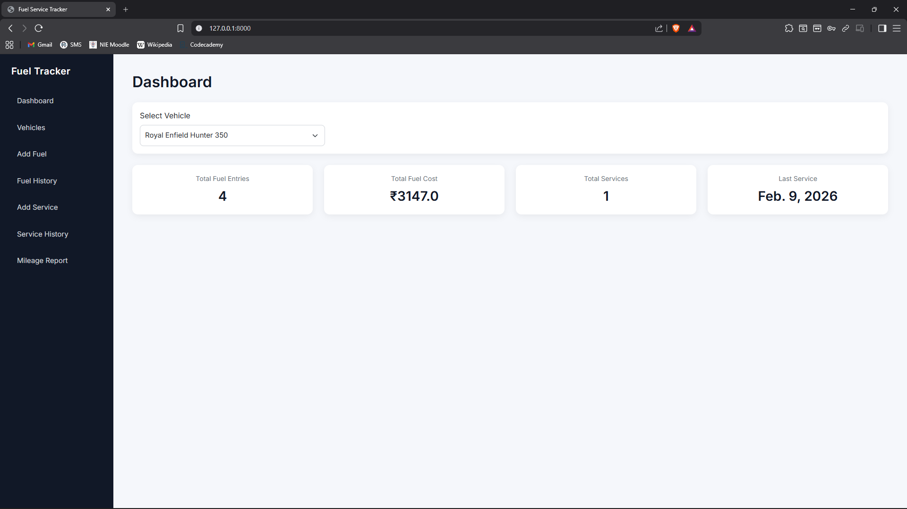
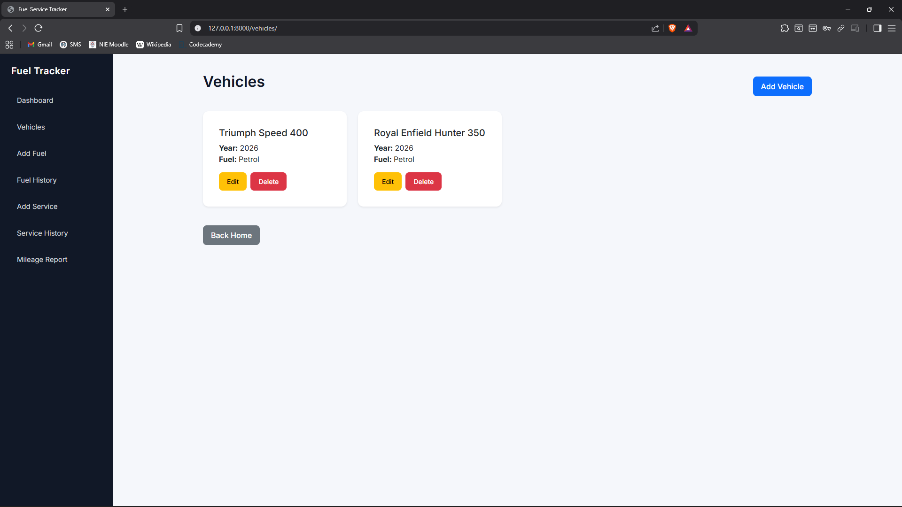
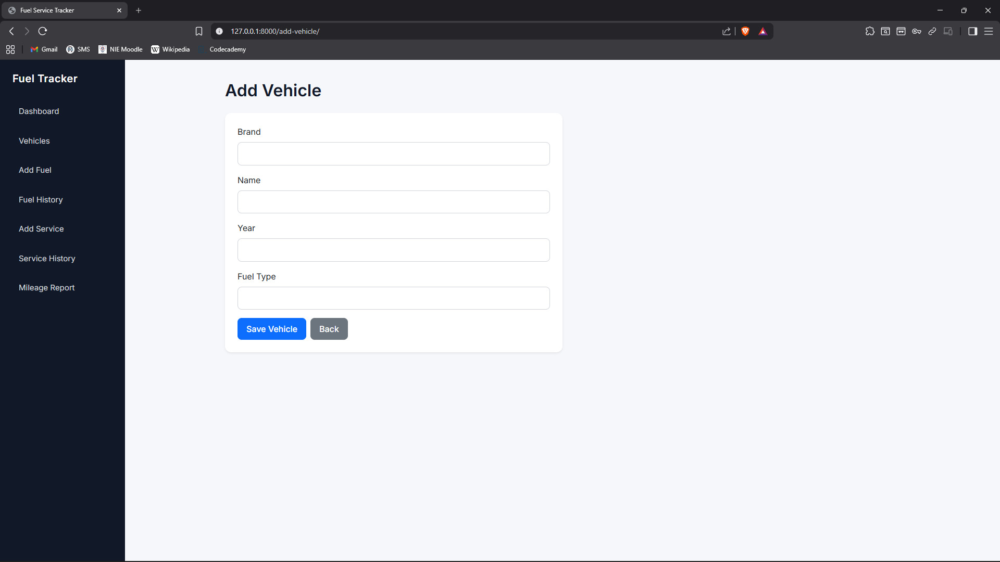
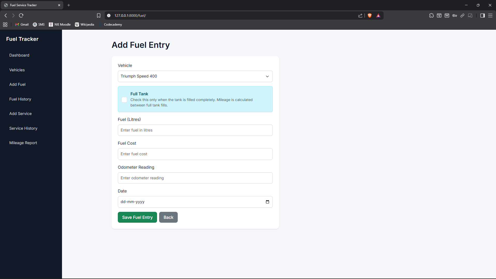
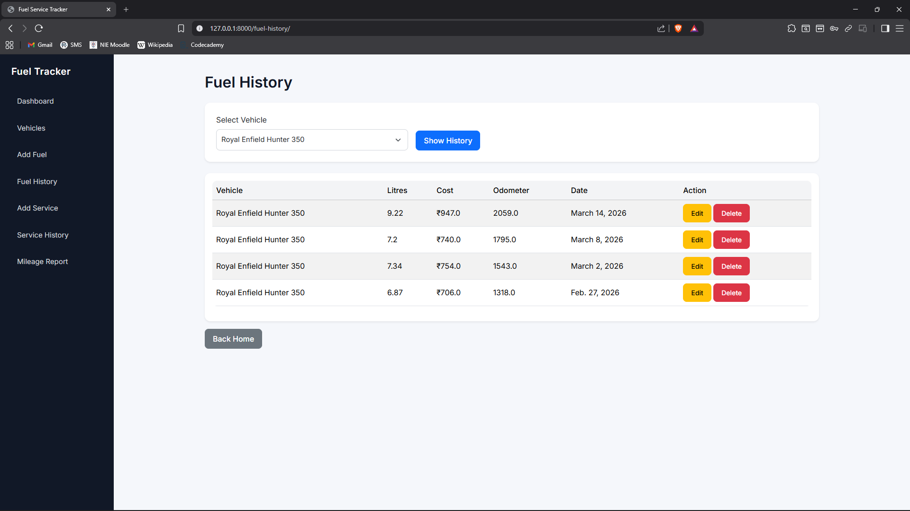
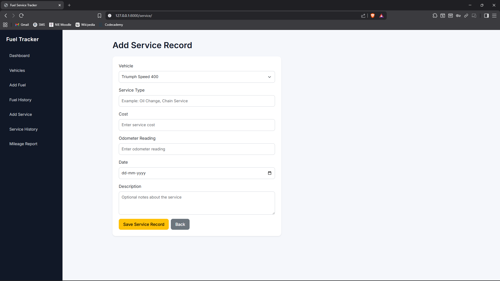
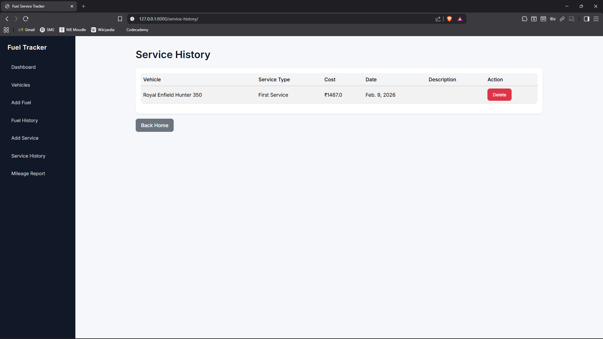
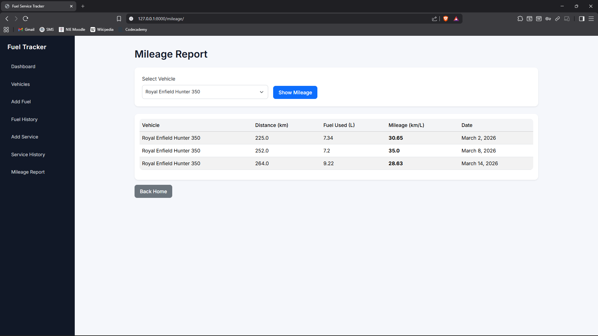

# Fuel & Service Tracker 🚗⛽

A robust Django-based web application designed to help vehicle owners track fuel consumption, service history, and calculate real-world mileage. This project focuses on backend CRUD operations, data validation, and preventing odometer rollback errors.

---

## 📖 Table of Contents

- Features
- Technologies Used
- Installation & Setup
- Mileage Calculation Logic
- Learning Goals
- Future Improvements
- Author

---

## 🚀 Features

- Vehicle Management – Add and manage multiple vehicles in one dashboard
- Fuel Tracking – Record fuel entries with odometer readings and cost
- Service Records – Maintain a digital log of all maintenance work
- Smart Mileage Calculation – Automated mileage calculation based on fuel entries
- Data Integrity – Prevent incorrect odometer entries (rollback protection)
- User Experience – Confirmation prompts for deletions and responsive UI using Bootstrap

---

## 🛠️ Technologies Used

Backend
- Python
- Django

Database
- SQLite

Frontend
- HTML5
- CSS3
- Bootstrap 5

---
## 📂 Project Structure

```text
fuel-service-tracker/
├── manage.py
├── db.sqlite3
├── fstp/                # Project Configuration
│   ├── settings.py
│   └── urls.py
└── trk/                 # Main Application Logic
    ├── models.py        # Database Schema
    ├── views.py         # Business Logic
    ├── urls.py          # App Routing
    ├── templates/trk/   # HTML Templates
    └── static/trk/      # CSS & Assets
```
---
## 📸 Screenshots

### Dashboard


### Vehicles Page


### Add Vehicle


### Add Fuel Entry


### Fuel History


### Add Service Record


### Service History


### Mileage Report


---

## 📥 Installation & Setup

### 1. Clone the repository

    git clone https://github.com/akshobyaas/fuel-service-tracker.git
    cd fuel-service-tracker

### 2. Create and activate virtual environment

Windows:

    python -m venv venv
    venv\Scripts\activate

Mac / Linux:

    python3 -m venv venv
    source venv/bin/activate

### 3. Install dependencies

    pip install django

### 4. Apply migrations and run the server

    python manage.py migrate
    python manage.py runserver

Open in browser:

    http://127.0.0.1:8000/

---

## 🧮 Mileage Calculation Logic

Mileage is calculated between two **full tank entries**.

Formula:

    Mileage = Distance Traveled / Total Fuel Consumed

Example flow:

1. Initial full tank entry (starting point)
2. Multiple partial fuel entries (optional)
3. Next full tank entry triggers mileage calculation

---

## 🎓 Learning Goals

This project was created to practice:

- Django Model-View-Template (MVT) architecture
- Model relationships and migrations
- CRUD operations
- Form handling and validation
- Data integrity (preventing odometer rollback)
- Designing simple functional UI

---

## 🔮 Future Improvements

- Interactive fuel efficiency charts
- User authentication and multi-user support
- Export service history as PDF or CSV
- Maintenance interval notifications
- Improved dashboard analytics

---

## 👤 Author

Akshobya A S

GitHub  
https://github.com/akshobyaas
